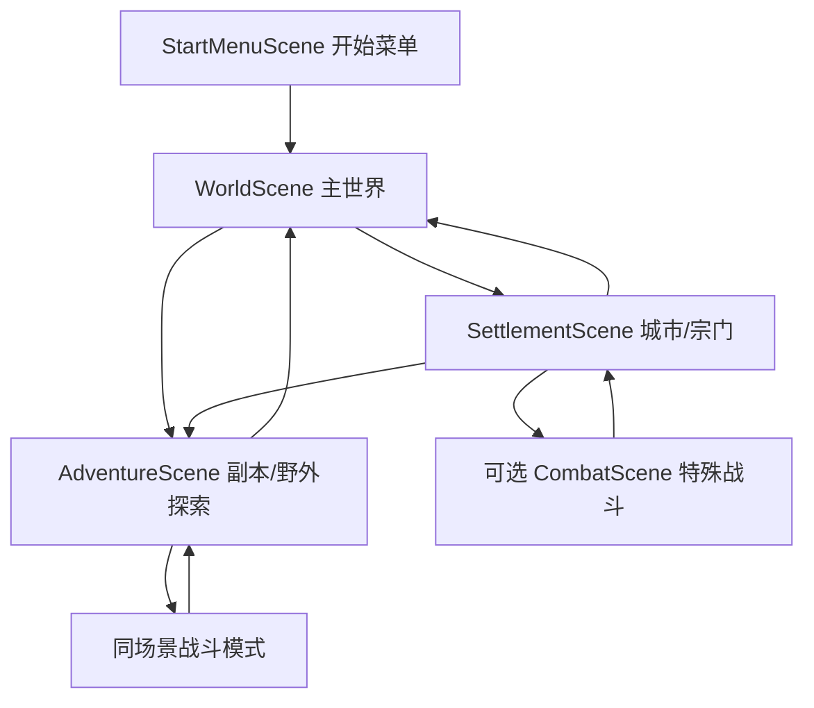

# 游戏场景架构设计

状态：⚠️ 已修改/未审核
日期：2026-06-19
适用范围：Unity 项目 `src/` 的场景组织、场景切换、主世界/城市/副本/战斗承载方式

## 目标

建立一套能从当前单一 `ExplorationScene` 平滑演进的场景架构。第一版优先支持开始菜单、节点式主世界、通用城市/宗门场景、副本探索场景，以及副本内同场景战斗模式。独立战斗场景只作为特殊战斗的扩展能力预留。

## 当前依据

1. 游戏类型是 2D 沙盒世界、战棋玩法的修仙游戏。
2. Unity 当前只有 `Assets/Scenes/ExplorationScene.unity`，场景内已经跑通探索、敌人生成、探索触发战斗、CTB 战斗循环、掉落和 UI。
3. `ExplorationController` 当前同时承担地图生成、玩家/敌人生成、探索输入、战斗触发、CTB 战斗循环和掉落，适合原型验证，但不适合作为长期场景边界。
4. 世界设计已有九域和宗门骨架，但城市、宗门内部、副本节点尚未细化到需要每个地点独立 Unity Scene。

## 推荐架构

采用“少量通用 Scene + 数据驱动节点”的混合架构。



核心原则：

1. 主世界第一版采用节点式大地图，不直接做连续 Tilemap 沙盒世界。
2. 城市和宗门共用 `SettlementScene`，由地点数据决定界面、功能入口和视觉主题。
3. 副本、野外遭遇、秘境和洞府共用 `AdventureScene`，由副本配置决定地形、敌人、事件和奖励。
4. 普通战斗不切换场景，直接在 `AdventureScene` 内切换到战斗模式。
5. 独立 `CombatScene` 只用于剧情战、Boss 战、竞技场、演出战或需要特殊战场资源隔离的战斗。

## 场景职责

### StartMenuScene

职责：

1. 新游戏、继续游戏、读档、设置、退出。
2. 新游戏时进入角色创建和门派选择。
3. 创建 `GameSession` 和全局 UI 根节点。
4. 新游戏完成后进入 `WorldScene`。

迁移点：

1. 现有 `SectSelectionManager` 应从探索场景迁到开始菜单流程。
2. `GameManager.StartGameWithSect` 保留为早期入口，但最终应改为写入 `GameSession.PlayerProfile`。

### WorldScene

职责：

1. 展示九域主世界节点图。
2. 承载移动、时间推进、区域解锁、随机事件入口和地点选择。
3. 从节点进入城市/宗门或副本。
4. 记录玩家在主世界的位置和返回点。

第一版表现：

1. 九域节点：江左天域、关陇玄域、陇西雷域、中州天域等。
2. 地点节点：宗门、城池、坊市、秘境入口、野外遭遇。
3. 移动方式：点击节点移动，消耗世界时间，触发概率事件。

暂不做：

1. 连续无缝大地图。
2. 大规模 NPC 模拟。
3. 地图 chunk 流式加载。

### SettlementScene

职责：

1. 作为城市、宗门、坊市、洞府的通用承载场景。
2. 根据地点类型显示功能入口。
3. 提供修炼、商店、任务、门派事务、人物互动、副本入口。
4. 返回 `WorldScene` 时保持玩家所在节点。

地点类型：

1. 城池：坊市、悬赏、客栈、商店、传送、情报。
2. 宗门：修炼、功法、任务、师门、法坛、副本入口。
3. 洞府：修炼、整理背包、丹药、存档、丹域相关预留。
4. 特殊地点：白玉京、天工城等可复用本场景，但使用专属配置和视觉主题。

第一版不要给每座城或每个宗门单独创建 Unity Scene。地点差异由 `SettlementDefinition` 数据驱动。

### AdventureScene

职责：

1. 承载副本、野外探索、秘境、洞府探险等局部地图。
2. 生成六角格地图、障碍、敌人、事件、资源点和出口。
3. 触发遭遇后进入同场景战斗模式。
4. 战斗结束后回到探索模式，保留地图状态。
5. 完成副本后返回来源场景。

当前 `ExplorationScene` 应定位为 `AdventureScene` 原型。

状态模式：

1. `Loading`：读取副本配置并生成地图。
2. `Exploration`：玩家在局部地图移动、探索、触发事件。
3. `BattlePrep`：锁定遭遇目标，准备 CTB 单位和 UI。
4. `Combat`：同场景战棋战斗。
5. `Reward`：结算掉落和事件结果。
6. `Exit`：返回世界或地点。

### CombatScene

职责：

1. 承载特殊战斗。
2. 使用独立战场地图、演出、Boss 机制或大型群战资源。
3. 战斗结束后回到来源场景。

第一版不强制实现。普通副本战斗继续放在 `AdventureScene` 内，减少加载次数和状态同步复杂度。

## 持久运行时对象

### GameSession

职责：

1. 玩家角色数据。
2. 当前世界时间。
3. 当前主世界节点。
4. 当前来源场景和返回点。
5. 背包、任务、已击败敌人、已探索副本状态。
6. 当前遭遇上下文。

生命周期：

1. 新游戏或读档时创建。
2. 使用 `DontDestroyOnLoad` 保持跨场景存在。
3. 切场景时只传递轻量 ID 和上下文，不传递场景对象引用。

### SceneFlowManager

职责：

1. 统一处理场景加载。
2. 写入和读取返回点。
3. 控制加载前保存、加载后初始化。
4. 屏蔽各玩法控制器直接调用 Unity `SceneManager` 的细节。

核心接口建议：

```csharp
public void StartNewGame(PlayerProfile profile);
public void EnterWorld(WorldNodeId nodeId);
public void EnterSettlement(SettlementId settlementId);
public void EnterAdventure(AdventureId adventureId, SceneReturnTarget returnTarget);
public void EnterSpecialCombat(EncounterId encounterId, SceneReturnTarget returnTarget);
public void ReturnToPreviousScene();
```

### UI 根节点

保留当前统一 `UICanvas` 方向，但需要拆分面板职责。

建议拆分：

1. `MenuUI`：开始菜单和角色创建。
2. `WorldUI`：主世界节点信息、时间、地点操作。
3. `SettlementUI`：地点功能入口和 NPC/任务面板。
4. `AdventureUI`：探索日志、地图行动。
5. `BattleUI`：HP/MP/CT、术法神通按钮、战斗日志。

`BattleUIManager` 可作为战斗 UI 原型继续使用，但不应长期负责探索、地点或菜单 UI。

## 数据定义

### WorldRegionDefinition

字段：

1. `id`
2. `displayName`
3. `description`
4. `dominantFactions`
5. `terrainTheme`
6. `spiritQiFeature`
7. `nodeIds`

来源：

1. `docs/地图/*.txt`
2. 后续可导入 CSV 或 ScriptableObject

### WorldNodeDefinition

字段：

1. `id`
2. `regionId`
3. `displayName`
4. `nodeType`
5. `connectedNodeIds`
6. `settlementId`
7. `adventureIds`
8. `unlockCondition`
9. `eventPoolId`

`nodeType` 第一版包括：

1. `RegionHub`
2. `City`
3. `Sect`
4. `Market`
5. `DungeonEntrance`
6. `WildEncounter`
7. `SpecialLocation`

### SettlementDefinition

字段：

1. `id`
2. `displayName`
3. `settlementType`
4. `regionId`
5. `ownerFactionId`
6. `availableServices`
7. `adventureEntrances`
8. `visualTheme`

`settlementType` 第一版包括：

1. `City`
2. `Sect`
3. `Cave`
4. `Market`
5. `Special`

### AdventureDefinition

字段：

1. `id`
2. `displayName`
3. `sourceNodeId`
4. `mapRadius`
5. `terrainTheme`
6. `obstaclePercent`
7. `enemyPoolId`
8. `eventPoolId`
9. `rewardPoolId`
10. `exitRule`

当前 `ExplorationController` 的 `mapRadius`、`obstaclePercent`、`enemyCount`、`enemyTemplates` 可以逐步迁入该定义。

### EncounterContext

字段：

1. `encounterId`
2. `encounterType`
3. `sourceScene`
4. `returnTarget`
5. `playerSnapshot`
6. `enemyParty`
7. `battleMapId`
8. `rewardPoolId`

普通副本遭遇在同场景内使用该上下文。特殊战斗切换到 `CombatScene` 时也使用同一上下文。

## 主要流程

### 新游戏流程

1. 启动 `StartMenuScene`。
2. 玩家选择新游戏。
3. 进入角色创建和门派选择。
4. 写入 `GameSession.PlayerProfile`。
5. `SceneFlowManager.EnterWorld(startNodeId)`。
6. 加载 `WorldScene` 并定位到起始节点。

### 主世界进入宗门流程

1. 玩家在 `WorldScene` 点击宗门节点。
2. `SceneFlowManager.EnterSettlement(settlementId)`。
3. 加载 `SettlementScene`。
4. `SettlementSceneController` 读取 `SettlementDefinition`。
5. 显示宗门功能入口。
6. 返回时调用 `SceneFlowManager.EnterWorld(previousNodeId)`。

### 主世界进入副本流程

1. 玩家在 `WorldScene` 点击副本或野外节点。
2. `SceneFlowManager.EnterAdventure(adventureId, returnTarget)`。
3. 加载 `AdventureScene`。
4. `AdventureSceneController` 读取 `AdventureDefinition` 并生成地图。
5. 玩家探索、触发敌人或事件。
6. 普通战斗进入同场景 `Combat` 状态。
7. 战斗结束回到 `Exploration` 或 `Reward` 状态。
8. 玩家通过出口回到 `WorldScene` 或 `SettlementScene`。

### 副本内普通战斗流程

1. 玩家接近或点击敌人。
2. `AdventureSceneController` 创建 `EncounterContext`。
3. `TacticalCombatController.StartCombat(context)`。
4. 锁定探索输入，显示战斗 UI。
5. CTB 战斗循环运行。
6. 战斗结束，写入敌人 defeated 状态和掉落。
7. 隐藏战斗 UI，恢复探索输入。

### 特殊战斗流程

1. 城市、宗门、副本或剧情事件创建 `EncounterContext`。
2. `SceneFlowManager.EnterSpecialCombat(encounterId, returnTarget)`。
3. 加载 `CombatScene`。
4. 战斗结束后按 `returnTarget` 回到来源场景。

## 从现有工程迁移

### 第一步：场景命名和 Build Settings

创建以下场景：

1. `Assets/Scenes/StartMenuScene.unity`
2. `Assets/Scenes/WorldScene.unity`
3. `Assets/Scenes/SettlementScene.unity`
4. `Assets/Scenes/AdventureScene.unity`

保留 `ExplorationScene.unity` 作为迁移前备份，或在确认后重命名为 `AdventureScene.unity`。

### 第二步：拆运行时管理器

新增：

1. `Assets/Scripts/Game/GameSession.cs`
2. `Assets/Scripts/Game/SceneFlowManager.cs`
3. `Assets/Scripts/World/WorldSceneController.cs`
4. `Assets/Scripts/Settlement/SettlementSceneController.cs`
5. `Assets/Scripts/Adventure/AdventureSceneController.cs`
6. `Assets/Scripts/Combat/TacticalCombatController.cs`

迁移原则：

1. 先不改战斗公式和 CTB 规则。
2. 先把 `ExplorationController` 的职责切开，但保留行为一致。
3. 每一步都保持 Unity 编译通过。

### 第三步：门派选择迁出探索场景

1. `SectSelectionManager` 归入 `StartMenuScene`。
2. 选择结果写入 `GameSession`。
3. `AdventureScene` 创建玩家时从 `GameSession` 读取数据，不再依赖延迟查找 `ExplorationController` 后重配玩家。

### 第四步：节点式主世界

1. 用静态数据先定义 4 个区域节点：江左天域、关陇玄域、陇西雷域、中州天域。
2. 每个区域放 1 到 3 个地点节点。
3. 点击节点进入 `SettlementScene` 或 `AdventureScene`。
4. 记录 `GameSession.CurrentWorldNodeId`。

### 第五步：通用城市/宗门场景

1. 用一套 `SettlementScene` 显示不同地点。
2. 第一版只做功能入口，不做复杂室内地图。
3. 宗门入口可包含修炼、功法、任务、副本。
4. 城市入口可包含坊市、悬赏、客栈、情报。

### 第六步：副本内战斗模式

1. 将现有 `ExplorationController.CombatLoop` 迁入 `TacticalCombatController`。
2. `AdventureSceneController` 保留探索状态和敌人状态。
3. 战斗结束只清理战斗上下文，不重载场景。

## 测试与验证

第一版验证清单：

1. 从开始菜单创建角色后能进入主世界。
2. 主世界点击宗门节点能进入宗门场景。
3. 宗门场景返回后仍在原主世界节点。
4. 主世界点击副本节点能进入副本场景。
5. 副本内触发普通战斗不发生场景切换。
6. 普通战斗结束后敌人保持 defeated 状态，玩家能继续探索。
7. 副本退出后能回到正确来源场景。
8. `GameSession` 在多次切场景后不重复创建。
9. `UICanvas` 不重复创建。
10. Unity 编译无错误。

## 风险与约束

1. 当前 UI 由代码动态创建，迁移时容易出现重复 `UICanvas` 或跨场景残留面板。需要在 UI 根节点层建立统一显示/隐藏规则。
2. `ExplorationController` 职责较重，拆分时必须小步迁移，先保持行为一致，再抽象数据。
3. 普通战斗放在副本场景内能减少加载，但要求探索状态和战斗状态隔离清楚，避免战斗输入穿透到探索输入。
4. 独立 `CombatScene` 如果过早引入，会增加返回点、玩家快照、敌人状态和 UI 同步复杂度。
5. 主世界若第一版直接做连续沙盒地图，会阻塞城市、宗门、副本和战斗循环整合。节点式大地图更适合当前阶段。

## 结论

第一版采用节点式主世界、通用城市/宗门场景、通用副本/探索场景，以及副本内同场景战斗。该方案能最大程度复用当前 `ExplorationScene` 原型，同时为后续连续沙盒世界、特殊战斗场景、宗门经营和丹域玩法保留扩展点。

