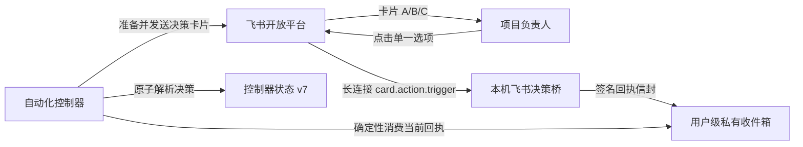

# 自动工作流飞书决策渠道设计

日期：2026-07-15

状态：用户已批准方案 A，待书面规格审阅

取证会话：`019f6622-4fda-7231-86c7-9bac61401aaf`

关联设计：`2026-07-15-automation-decision-lifecycle-repair-design.md`

## 1. 背景与结论

现有待决策流程把 Gmail 同时当作通知渠道、回复查询源和身份凭据。目标会话已复现以下故障链：Gmail 全邮箱查询触发项目配额限制，没有取得任何回复证据；自动化随后把“查询失败”误判为“未收到”，调用通知重试时又漏传当前 `decisionId`，最终由控制器以 `decision_id_mismatch` 拒绝并干净关闭。

本设计采用用户已选择的方案 A：以飞书企业自建应用发送交互卡片，以飞书官方长连接接收 `card.action.trigger` 回调。负责人在卡片中直接点击 A/B/C 完成决策；模型不再查询邮箱或聊天记录，也不再拼装通知重试参数。

## 2. 目标

- 在中国大陆可稳定使用的飞书客户端内完成待决策通知和单项选择。
- 决策卡片展示任务、问题、选项、推荐项和影响摘要，点击按钮即可登记选择。
- 使用本机主动建立的长连接接收回调，不要求公网 IP、域名、证书或第三方中转服务。
- 只接受已配对负责人对当前活动决策的单一选择；旧卡片、重复点击、错误编号和其他用户操作不得推进状态。
- 把通知与回复处理下沉到确定性控制面，模型只消费控制器返回的已验证结果。
- 保留现有 Gmail 通知尝试、人工选择和决策链审计，不修改既有历史含义。
- 先完成隔离测试和真实金丝雀，再停用 Gmail 活动路径；任何切换失败都不影响现有待决策状态。

## 3. 非目标

- 不修改 TQ-057 的术法数据、双倍率口径或当前待决策的业务选项。
- 不让飞书桥接进程修改项目文件、Git 索引、任务队列或自动化状态正文。
- 不接入普通微信、企业微信、QQ、钉钉或多渠道广播；这些渠道只保留为未来可替换 provider。
- 不构建通用聊天机器人、自然语言命令解析或飞书群管理能力。
- 不把 App Secret、负责人原始标识、收件目标或回调正文写入 Git、项目状态、automation memory 或最终回复。
- 不在本轮顺便重构与待决策无关的自动工作流控制面。

## 4. 方案比较

### 4.1 飞书只发送通知，选择仍回到 Codex

实现最小，但负责人仍需寻找对应 Codex 会话并手动输入选择，不能真正替代邮件决策确认，不采用。

### 4.2 飞书文字回复

需要额外的单聊消息读取权限、文本格式校验和消息事件消费；仍存在模糊回复、重复消息与轮询/检索语义，和现有邮件故障形态相似，不采用。

### 4.3 飞书交互卡片与长连接

卡片按钮提供结构化 `decisionId + optionKey`，回调携带操作者身份和唯一事件标识；长连接由本机主动外连，不需要公网回调地址。这是采用方案。

## 5. 总体架构

### 5.1 自动化控制器

`tools/automation-controller.ps1` 继续是模型唯一允许调用的入口。它增加 provider 无关的通知准备、发送结果登记和回复消费动作，但不直接维护长连接。控制器负责：

- 从活动 `pendingDecision` 构建规范化卡片载荷；
- 调用飞书发送适配器，并验证返回的提供方消息 ID；
- 检查桥接健康状态和当前决策回执；
- 调用状态工具原子记录通知尝试或解析选择；
- 返回明确 `nextCommand`，不要求模型补写 `decisionId`、收件目标或回复来源。

现有 `ResolveDecisionManual` 保留作为负责人在 Codex 对话中明确选择时的人工入口。邮件动作在迁移期保留读取兼容性，但从部署 prompt 和活动路由中移除。

### 5.2 飞书发送适配器

新增隔离的 Node.js 工具目录 `tools/feishu-decision-bridge/`，使用飞书官方 Node SDK，并通过 `package-lock.json` 固定依赖。发送命令是短生命周期进程，只执行以下职责：

1. 从用户级私有配置读取 App ID、App Secret 和接收目标；
2. 获取并缓存 SDK 管理的应用访问凭证；
3. 在用户级 `<stateRoot>/send-intents/` 内持久化净化发送意图，再以稳定 UUID 发送一张 `interactive` 决策卡片；
4. 只向 stdout 返回脱敏 JSON：结果、提供方消息 ID 哈希、目标哈希、卡片 nonce 哈希和发送意图哈希；
5. 不输出 token、Secret、原始接收目标或完整提供方响应。

飞书官方 UUID 去重只承诺 1 小时，不能单独承担跨小时幂等。发送器以 `provider + decisionId + attemptNumber` 的领域隔离 SHA-256 作为 `intentKeyHash`，文件名只允许 64 位小写 hex。意图文件仅保存 UUID、目标/请求内容/card nonce/提供方消息 ID 的哈希、时间和有限状态；不保存原始收件人、凭证、`decisionId`、卡片 nonce、卡片内容或原始消息 ID。

同一意图首次调用 provider 前必须在排他锁内原子落盘 `PREPARED → IN_FLIGHT`。`IN_FLIGHT` 或 `OUTCOME_UNKNOWN` 可在 `firstAttemptAt` 后 55 分钟安全窗内，且 UUID、内容、目标和 nonce 哈希完全相同时重试；达到 55 分钟后不得再调用 transport，结果锁定为 `PROVIDER_OUTCOME_UNKNOWN` 并要求人工核对。`ACCEPTED` 和 `REJECTED` 必须直接返回已持久化的净化结果，不再调用 provider。损坏、不匹配、锁竞争或任何终态落盘失败都失败关闭为 `PROVIDER_OUTCOME_UNKNOWN`，不覆写原证据。

稳定 UUID 由 provider、`decisionId` 和通知序号确定。Card nonce 必须由私有 `hmacKey` 对领域隔离后的 provider、`decisionId` 和尝试号做 HMAC-SHA256 派生：同一意图可重建，不同密钥/尝试/领域不同，不可用无密钥摘要预测。Outbox 和发送意图只持久化 nonce 哈希。

### 5.3 飞书长连接桥

同一工具目录提供常驻桥接进程，使用官方 SDK 主动建立 WebSocket 长连接并注册 `card.action.trigger`：

- 只处理本应用、预期 tenant 和卡片动作类型；
- 使用 `event_id` 去重；
- 只接受对象形式的回传 `value`；
- 把通过基础结构校验的回调写成用户级原子信封；
- 信封使用本机私有 HMAC 密钥签名，控制器消费前必须验签；
- 写入新鲜健康心跳，但不读取或修改 Git 项目文件；
- 日志只记录时间、事件 ID 哈希、结果类别和连接状态。

桥接进程通过显式安装脚本注册为 Windows 登录后启动的计划任务。安装、更新、停止和卸载均使用固定脚本；不得依赖可见终端窗口或 Codex 会话常驻。

### 5.4 私有配置与负责人配对

私有配置固定保存在 `%USERPROFILE%\.codex\automation-state\tzg-hourly-controller.feishu.private.json`，不进入仓库。配置文件至少包含：

- `schemaVersion`；
- App ID 与 App Secret；
- 预期 tenant；
- 接收目标类型和值；
- 已配对负责人 Open ID 的哈希；
- HMAC 密钥；
- 桥接与收件箱路径。

设置脚本交互式读取 Secret 和接收目标，控制台不回显 Secret；写入后移除继承 ACL，只允许当前 Windows 用户和 SYSTEM 读取。程序、日志、测试和最终回复不得输出原始值。

首次部署使用一次性“绑定当前负责人”金丝雀卡片。卡片包含随机配对 nonce，只发送到私有配置目标；负责人点击后，桥接校验 nonce 并把回调操作者 Open ID 的哈希登记为唯一允许身份。真实决策只接受该哈希。若接收目标不能按飞书邮箱定位，设置脚本支持显式 Open ID 作为替代，不扩大到群聊广播。

## 6. 决策卡片

卡片固定包含：

- 标题：`天章项目需要决策`；
- 决策编号与关联任务；
- 问题正文；
- A/B/C 等全部单项选项；
- 推荐项及影响摘要；
- 每个选项一个按钮，按钮 `value` 仅包含版本、`decisionId`、`optionKey` 和随机 card nonce；
- 提示“选择后将直接登记，旧卡片不会覆盖新决策”。

点击成功后，回调响应把卡片更新为“已选择 X”，移除可操作按钮并显示登记时间。若桥接暂时离线、身份不符、卡片过期或决策已变化，卡片只显示未登记/已过期提示，控制器状态保持不变。

## 7. 状态模型 v7

状态 schema v7 延续 v6 的 `pendingDecision + decisionFlow`，只扩展渠道证据。

### 7.1 通知尝试

每条 `notificationAttempts[]` 增加：

- `provider`：`gmail_legacy | feishu`；
- `providerMessageIdHash`；
- `targetHash`；
- `result`：`PROVIDER_ACCEPTED | PROVIDER_OUTCOME_UNKNOWN | DELIVERY_FAILED | MISADDRESSED | CHANNEL_UNAVAILABLE`；
- `errorCategory`；
- `attemptedAt`。

三次重试上限按 provider 分别计算。既有 Gmail 两次尝试原样迁移为 `gmail_legacy`，不会占用飞书的尝试额度，也不会被删除或重写。

`CHANNEL_UNAVAILABLE` 表示 provider 调用前的本地前置不可用，包括桥接健康失败、SDK 导入失败、client 初始化失败或配置未完成；它零 provider 调用、不算一次实际发送，且只写用户级净化诊断。`INVALID_INPUT` 仅用于配置或请求不合法。`PROVIDER_OUTCOME_UNKNOWN` 表示已可能调用 provider，但结果无法被可靠证明；它不计入失败重试，不允许创建新 attempt/UUID 自动补发，超出安全窗后必须人工核对。`PROVIDER_ACCEPTED` 仍只表示飞书 API 接受并返回消息 ID，不表示负责人已经点击。

### 7.2 选择证据

飞书选择写入：

- `source = feishu_card`；
- `optionKey`；
- `resolvedAt`；
- `providerEventIdHash`；
- `operatorOpenIdHash`；
- `providerMessageIdHash`；
- `evidenceHash`。

项目状态只显示“飞书卡片选择”，不显示操作者标识、接收目标或消息 ID。

### 7.3 回执消费

控制器只消费同时满足以下条件的一个信封：

1. HMAC 有效且文件位于固定用户级收件箱；
2. `decisionId` 与当前 `pendingDecision` 完全相同；
3. `optionKey` 是当前选项中的单一键；
4. 操作者哈希与已配对负责人一致；
5. provider 消息 ID 与当前决策已接受的飞书通知一致；
6. event ID 和 card nonce 尚未消费；
7. 回调时间不早于决策创建时间，且卡片未超过飞书交互有效期。

有效回执通过状态工具原子完成 v6 已定义的“移入 `decisionFlow.resolvedDecisions`、清空 `pendingDecision`、进入 `IMPLEMENTATION_PENDING`”。无效、重复或过期信封移入隔离目录并记录脱敏原因，不修改项目状态。

## 8. 故障语义

- **回复查询失败不再存在**：飞书使用推送回调，不轮询聊天记录。
- **provider 调用前本地不可用**：桥接不健康、SDK 导入失败或 client 初始化失败均返回 `CHANNEL_UNAVAILABLE`；不建立发送意图、不调用 provider、不增加发送次数。
- **provider 明确拒绝**：官方 SDK 返回可判定的非零业务错误码时记录 `REJECTED`，返回 `DELIVERY_FAILED`；只有该结果允许状态机创建新的飞书发送尝试。
- **provider 结果不明**：超时、断连、异常抛出、无效响应或缺少消息 ID 均先落盘 `OUTCOME_UNKNOWN`，再返回 `PROVIDER_OUTCOME_UNKNOWN`；不计入失败重试，不允许自动换新 attempt/UUID 补发。
- **API 已接受但桥随后掉线**：不自动重发卡片。桥重连后负责人可再次点击原卡片；状态继续等待。
- **重复点击**：首次有效回执获胜，后续事件幂等忽略。
- **错误用户或旧卡片**：隔离证据，不推进任务，不触发默认选择。
- **达到飞书三次发送上限**：保持待决策并显示人工入口，不回退 Gmail、不自动选择、不失败关闭业务任务。
- **桥接进程崩溃**：Windows 计划任务按有限次数重启；持续失败只写用户级健康状态和 automation memory 摘要。

“没有取得回复证据”“发送前本地不可用”“provider 明确拒绝”和“provider 结果不明”必须是四个不同状态。只有明确拒绝才可以创建新通知尝试。

## 9. 当前现场迁移与切换

当前 `DEC-20260715-75D7BA2AF210` 保持原编号、任务、问题和选项，迁移步骤为：

1. 暂停 `tzg-hourly-controller`，确认没有活动租约和桥接子进程。
2. 在状态副本上执行 schema v6→v7 dry-run，验证既有 Gmail 尝试、决策链和审计更正不变。
3. 配置飞书私有文件并完成负责人绑定金丝雀；金丝雀不创建项目决策、不修改项目文件。
4. 发送一张独立测试卡片，验证发送、按钮回调、身份绑定、重复点击和脱敏日志。
5. 应用 v7 状态迁移，为当前决策发送第一张飞书卡片；既有 Gmail 卡片/邮件历史只读保留。
6. 更新项目规则、薄提示词和部署自动化，使活动路径只使用飞书 provider 与人工 Codex 入口。
7. 使用 `codex_app__automation_update` 更新现有 `tzg-hourly-controller`；不得直接编辑 `automation.toml`，不得创建第二个写入型自动化。
8. 运行真实待决策只读金丝雀，确认控制器状态为 `IDLE + AWAITING_DECISION`、桥健康、Git 工作区基线未变化后恢复每小时调度。

在第 4 步完整通过以前，Gmail 活动路径不删除；在第 6 步切换后，Gmail 只保留历史兼容和人工回滚代码，不再由模型搜索或发送。

## 10. 文件与组件边界

- `tools/feishu-decision-bridge/package.json`、`package-lock.json`：隔离并固定官方 SDK 依赖。
- `tools/feishu-decision-bridge/src/send-decision.mjs`、`send-core.mjs`、`send-runtime.mjs`：短生命周期发送、幂等编排与 SDK 错误分类。
- `tools/feishu-decision-bridge/src/send-intent-store.mjs`：用户级净化发送意图、排他锁、原子落盘和 55 分钟安全窗。
- `tools/feishu-decision-bridge/src/bridge.mjs`：长连接、结构校验、签名信封、去重和健康心跳。
- `tools/feishu-decision-bridge/src/config.mjs`、`card.mjs`、`envelope.mjs`：私有配置、卡片构建和证据边界。
- `tools/setup-feishu-decision-channel.ps1`：交互式私有配置、ACL、负责人配对和金丝雀。
- `tools/install-feishu-decision-bridge.ps1`：Windows 计划任务安装、更新和卸载。
- `tools/automation-controller-state.ps1`：schema v7、provider 尝试与 `feishu_card` 证据。
- `tools/automation-controller.ps1`：provider 路由、健康检查、发送与回执消费。
- `tools/automation-decision-status.ps1`：飞书通知/选择的项目可见摘要。
- `开发管理/自动工作流规则.txt`、`开发管理/自动工作流控制器提示词.txt`：活动渠道和故障语义唯一规则源。
- 对应 state/controller/decision-status/bridge 测试与 workflow checker：安全回归。

桥接进程不拥有 Git 写权限语义，不调用 workspace guard、finalizer、状态发布器或任务实施入口。

## 11. 测试设计

实现遵循 TDD，先建立失败测试并确认失败原因：

1. 卡片载荷完整包含当前选项、推荐项和不含私密字段的按钮值。
2. 发送成功只返回脱敏消息证据；用户级发送意图与稳定 UUID 共同防止同一逻辑尝试跨小时重复卡片。
3. Secret、token、接收目标和 Open ID 不出现在 stdout、日志、项目状态或 fixture 快照。
4. HMAC 错误、错误 app/tenant、未知操作者、错误消息 ID、旧 decisionId、非法 option、多选和过期回调全部拒绝。
5. 同一 event ID、card nonce 或重复按钮点击只能解析一次。
6. provider 调用前本地不可用不会建 intent、发送或增加尝试；明确拒绝才计入失败尝试，结果不明不自动换 attempt/UUID。
7. 模拟 API 接受后终态落盘崩溃、超时/断连、无效响应、55 分钟超窗、损坏/不匹配 intent、锁竞争和两进程并发都失败关闭，且 provider 调用次数符合契约。
8. Gmail 查询/历史状态不会触发飞书重发，两个 provider 的尝试上限独立。
9. schema v6→v7 fixture 保留当前决策、Gmail 两次尝试、决策链与审计更正。
10. 有效飞书回执记录 `source=feishu_card`，并按 v6 原子转换进入 `IMPLEMENTATION_PENDING`。
11. 项目状态只显示脱敏渠道摘要。
12. setup 脚本生成用户级配置并正确收紧 ACL；缺失或宽松 ACL 时桥拒绝启动。
13. 计划任务安装、重复安装、停止和卸载幂等，且不创建可见终端窗口。
14. 端到端金丝雀覆盖：发送绑定卡片 → 负责人点击 → 建立身份 → 发送测试决策 → 点击 → 重复点击拒绝。

共享控制面改动完成后合并运行一次 controller、state、decision status、workflow checker、review text、暂存前行尾检查与 cached diff 检查。该任务不修改 Unity、CSV、BattleSim 或数值事实源，不运行其无关回归。

## 12. 部署、回滚与验收

### 部署顺序

1. 控制器保持暂停并完成全部隔离测试。
2. 运行私有配置与负责人绑定金丝雀。
3. 安装桥接计划任务，验证健康心跳和自动重连。
4. 迁移状态副本并验证，再应用真实 v7 迁移。
5. 更新规则、薄提示词和自动化记录。
6. 为当前决策发送飞书卡片并验证项目状态。
7. 恢复唯一写入型控制器。

### 回滚

若金丝雀、状态迁移或自动化更新失败：保持控制器暂停；停止桥接计划任务；恢复迁移前用户级状态备份和旧 prompt；保留项目 Git 提交与脱敏失败证据。不得取消当前决策、清除 Gmail 历史、创建默认选择或产生空提交。

### 验收标准

- 负责人可以在飞书卡片中看到完整决策并以单击完成选择。
- 无公网服务器也能稳定接收回调；登录后桥自动启动且健康状态可诊断。
- 只有已配对负责人、当前决策和合法单项选择可以推进状态。
- 模型不再访问 Gmail、搜索聊天回复或拼装通知重试参数。
- Gmail 配额、查询失败或旧邮件不会导致重复飞书通知。
- 当前决策编号与全部历史审计保持不变。
- App Secret、原始目标和负责人标识不进入 Git、memory、项目状态或对话输出。
- 部署后只有 `tzg-hourly-controller` 一个活动写入型自动化，本机状态最终为 `IDLE` 或合法 `AWAITING_DECISION`，项目外既有改动不变。

## 13. 自审

- 文档没有待办占位、占位接口或未选择的实现分支。
- 渠道准备、发送、回调、证据、状态转换和失败语义互相一致。
- “查询失败”“渠道不可用”“发送失败”已明确分离，避免复现目标会话的错误重试。
- 现有决策与 Gmail 历史通过显式迁移保留，不静默改写。
- 桥接进程与唯一 Git 写入控制器职责隔离。
- 实施范围聚焦飞书决策渠道，没有扩展到通用聊天机器人或其他通讯平台。
