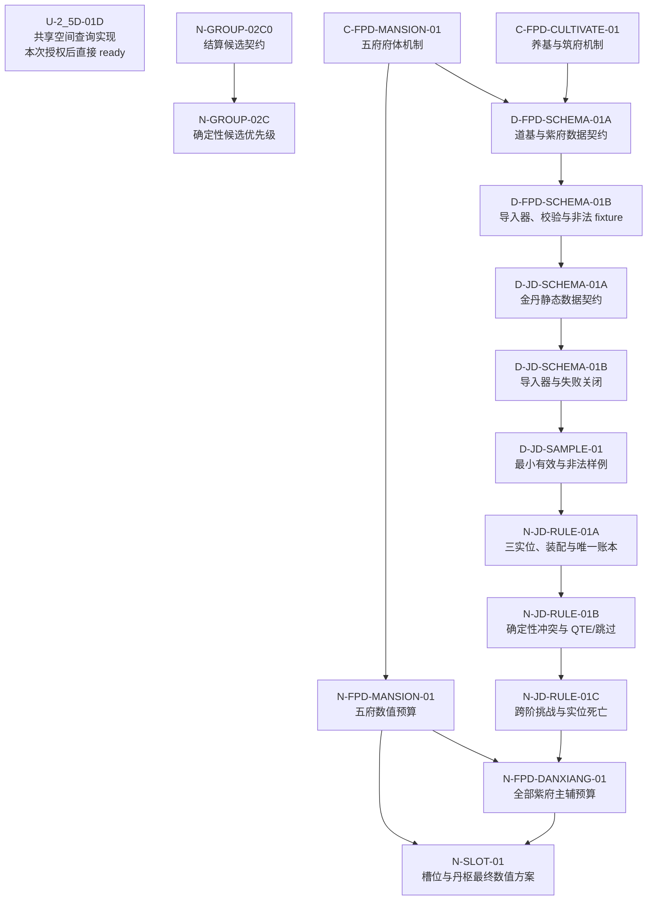

# 三项阻塞任务完整依赖解锁与拆分设计

> 日期：2026-07-25
> 状态：已由负责人确认方案 A、任务拆分、建卡与验证边界
> 目标：不删减既有完成条件，不伪造前置结果，将 `U-2_5D-01D`、`N-GROUP-02C`、`N-SLOT-01` 的阻塞原因拆成可独立审核、独立验证、逐级解锁的任务。

## 一、负责人决定与范围

负责人选择完整关闭全部依赖的方案 A，并确认：

1. 不通过删除 blocker、收窄原任务或填写假默认值强制三张卡同时进入 `ready`。
2. 将完整依赖链拆成多个独立任务；只有当前前置已满足的叶子任务进入队列。
3. `U-2_5D-01D` 获得独立重新实施授权，但仍须遵守既有回滚结论、生产环境档案显式绑定和失败关闭边界。
4. `C-FPD-MANSION-01` 与 `C-FPD-CULTIVATE-01` 的对应机制设计范围解除冻结；这不解除其他内容任务、M7、M8 或批量内容生产冻结。
5. `N-GROUP-02C` 先由独立前置任务锁定可观察结算候选的所有者与数据语义；不得预估随机伤害、提前消耗 RNG 或把命中集合当作击杀集合。
6. `N-SLOT-01` 保持“最终数值方案”的原始职责，必须等五府预算和丹相主辅预算真实完成后才可进入 `ready`。

## 二、设计原则

- 现有父任务保留稳定 ID 和完成定义；拆出的子任务用后缀 ID 表示独立交付。
- 任务卡只为进入近期调度或发生状态事件的任务建立；未来子任务先保留在分线 backlog 的短投影中。
- 下游任务只接受任务归档、验证结果和合法状态投影作为前置完成证据。
- 机制设计只锁定规则、状态、参数名和边界；数值由 BattleSim 任务锁定；数据契约不得把 fixture 写成生产默认值；Unity 不反向创作机制。
- 任一子任务命中停止条件时只阻塞本分支及其下游，不用兼容层、默认值或跨层补丁继续推进。

## 三、任务依赖结构

## 四、独立任务合同

### 4.1 首批可执行任务

#### `C-FPD-MANSION-01` · 五府府体机制

- 交付：命、魂、识、悟、运各一项府体机制；逐项声明触发、条件、目标、效果类型、与镇府神通及府间节点的边界。
- 禁止：倍率、概率、持续、CT、资源量、槽位数、按府数自动增槽、递归效果包。
- 完成证据：负责人确认五项机制，且均可由统一平铺效果绑定表达。

#### `C-FPD-CULTIVATE-01` · 养基、筑府与闭关机制

- 交付：连续养基、府胚蕴养、开府考验、失败回退、资源耗尽、事件暂停、目标完成、玩家自设停止和存档边界。
- 禁止：周期长度、资源量、损耗比例、成功阈值、抽签式筑基、残缺道基或残缺紫府。
- 完成证据：玩家与 NPC 共用同一合法行动集合，生命周期和停止原因均获负责人确认。

#### `U-2_5D-01D` · 共享空间查询契约实现与旧范围逻辑迁移

- 状态事件：本次负责人决定构成独立重新实施授权，可从 `frozen` 转为 `ready`。
- 实施仍以既有任务卡为唯一范围；不得复用已回滚实现作为完成证据。
- 正式 `AdventureScene` 必须显式绑定已复审的生产环境档案，且直接回归证明相邻敌人仍可触发战斗。
- 不新增默认档案、兼容分支、第二空间服务、视觉规则源或旧基础步数范围 fallback。

#### `N-GROUP-02C0` · 每行动结算候选契约

- 交付：定义结算候选所有者、必需字段、缺失语义、可观察原因和与行动执行的边界。
- 候选只能由行动生产者提供已经解析的事实；选择器不得自行计算或预估伤害。
- 必需信息至少包括：主要目标稳定 ID、合法命中目标集合、已经解析的击杀目标集合、稳定输入顺序，以及 `resolved`／`unavailable` 两种结算证据状态。
- `resolved` 且击杀集合为空表示已经确认零击杀；`unavailable` 表示行动生产者尚未形成可用于选择的结算事实，两者不得混写。
- 排序中的“可击杀敌人数”严格解释为已经解析、可证明的击杀目标数。`unavailable` 候选在这一层贡献证据数 0，并输出稳定原因 `settlement_evidence_unavailable`，但不宣称实际行动一定无法击杀。
- 当前格挡、闪避、暴击和功法随机效果尚未解析时，不能提前消耗全局 RNG 或复制随机结算；行动生产者必须返回 `unavailable`，不得伪造 `resolved` 空集合。
- 完成后，`N-GROUP-02C` 从 `pending_decision` 转为 `ready`；其实现只消费该契约。

### 4.2 筑基与紫府数据链

#### `N-FPD-MANSION-01` · 五府府体预算

- 依赖：`C-FPD-MANSION-01`。
- 交付：五项机制的共同预算、差异预算、参数区间、上限、目标指标和 1～5 府边际收益。
- 验证：BattleSim 覆盖单府、三府、五府及五类极端样例；第四、第五府有实际收益但不产生槽位或位格。

#### `D-FPD-SCHEMA-01A` · 道基、紫府、效果与修炼数据契约

- 依赖：`C-FPD-MANSION-01`、`C-FPD-CULTIVATE-01`。
- 交付：唯一道基、四阶段连续进度、容量、五府状态、镇府神通、平铺效果绑定、强化节点、结丹锁、修炼行动和停止原因的静态契约及正反 fixture。
- 未锁定数值只能显式缺失或存在于测试 fixture。

#### `D-FPD-SCHEMA-01B` · 数据导入、校验与失败关闭

- 依赖：`D-FPD-SCHEMA-01A`。
- 交付：CSV／asset、数据对象、导入器、检查器和直接 EditMode 测试。
- 失败关闭：未知阶段、容量越界、同类双府、建成府缺少必需绑定、递归效果包、结丹后新增府、旧新 schema 并存。
- `D-FPD-SCHEMA-01A` 与 `01B` 均完成后，父任务 `D-FPD-SCHEMA-01` 才完成。

### 4.3 金丹数据与 BattleSim

#### `D-JD-SCHEMA-01A` · 金丹静态数据契约

- 依赖：`D-FPD-SCHEMA-01B`。
- 交付：道路、基础效果、三实位、唯一丹枢、唯一丹相、全部紫府输入、主辅承载、能力实例 ID、资源／冷却账本、冲突及表现／本地化稳定键。
- 不要求正式显示名先落入数据；显示层通过稳定键引用，未确认名称不得写成正式事实。

#### `D-JD-SCHEMA-01B` · 金丹导入与失败关闭

- 依赖：`D-JD-SCHEMA-01A`。
- 交付：数据模型、导入器、检查器、正反 fixture 和直接测试。
- 失败关闭：未知道路／效果／位格、同一实例重复结算、第二丹枢或第二丹相、超过三实位、缺少账本所有者、非法主辅引用和旧九品语义静默兼容。
- `D-JD-SCHEMA-01A` 与 `01B` 均完成后，父任务 `D-JD-SCHEMA-01` 才完成。

#### `D-JD-SAMPLE-01` · 最小有效与非法样例

- 依赖：`D-JD-SCHEMA-01B`。
- 交付：至少一组覆盖一府一位、三府三位、五府三位的有效 fixture，以及重复实例、越权位格、第二丹相、非法主辅关系等失败 fixture。
- 样例只证明契约可消费，不代表 51 项正式玩法档案、完整内容迁移或生产平衡已经完成。

#### `N-JD-RULE-01A` · 三实位、装配与唯一账本

- 依赖：`D-JD-SAMPLE-01`。
- 交付：BattleSim 接入三实位资格、装配、唯一丹枢／丹相、能力实例和资源／冷却独立账本。

#### `N-JD-RULE-01B` · 确定性冲突与 QTE/跳过

- 依赖：`N-JD-RULE-01A`。
- 交付：合法性过滤、确定性冲突排序、可选 QTE 与跳过后的同结果结算。
- QTE 只影响输入方式，不改变合法性、预算或随机胜者。

#### `N-JD-RULE-01C` · 跨阶挑战与实位死亡

- 依赖：`N-JD-RULE-01B`。
- 交付：版本化跨阶挑战档案、实位载体死亡、账本释放／保留和可观察拒绝原因。
- `N-JD-RULE-01A`、`01B`、`01C` 均完成后，父任务 `N-JD-RULE-01` 才完成。

#### `N-FPD-DANXIANG-01` · 全部紫府输入与主辅预算

- 依赖：`N-FPD-MANSION-01`、`N-JD-RULE-01`。
- 交付：1～5 府 × 1～3 实位的主承载、辅助输入、唯一实例账本、资源／冷却预算、组合上限和第四／第五府边际收益。
- 验证：BattleSim 覆盖一府一位、三府三位、五府三位、主一辅多、重复引用和安全重铸。

#### `N-SLOT-01` · 金丹槽位与丹枢加成最终数值方案

- 依赖保持不变：`N-FPD-MANSION-01`、`N-FPD-DANXIANG-01`。
- 只有两项依赖均完成后才从 `blocked` 转为 `ready`。
- 交付仍为术法槽、普通神通槽和合法丹枢接口的最终数值方案；不得按府数、府属、第四／第五府或稳定位格数量自动增槽。

## 五、队列与状态事件

初始 ready 队列按现有固定排序规则放入：

1. `C-FPD-MANSION-01`（P1）
2. `C-FPD-CULTIVATE-01`（P1）
3. `U-2_5D-01D`（P2）
4. `N-GROUP-02C0`（P3）

后续只在前置完成事件发生时建立对应完整任务卡并插入队列：

- `C-FPD-MANSION-01` 完成后：解锁 `N-FPD-MANSION-01`；若 `C-FPD-CULTIVATE-01` 也完成，同时解锁 `D-FPD-SCHEMA-01A`。
- `N-GROUP-02C0` 完成后：解锁 `N-GROUP-02C`。
- `D-FPD-SCHEMA-01A` 完成后：解锁 `D-FPD-SCHEMA-01B`。
- `D-FPD-SCHEMA-01B` 完成后：解锁 `D-JD-SCHEMA-01A`。
- 此后按依赖图逐级解锁，直至 `N-FPD-DANXIANG-01` 和 `N-SLOT-01`。

首次队列补位提交核验通过后，外部普通管理上下文确认 lease 与 recovery 均为空，再清除 `queue:no_runnable_candidate` 逻辑暂停，并通过自动化管理接口保持 `tzg-hourly-controller` 的完整现有配置为 `ACTIVE`。

## 六、验证矩阵

| 类型 | 最小充分验证 |
|------|--------------|
| 任务卡与状态 | `tools/check-task-cards.ps1 -OutputJson`、任务卡／backlog／队列一致性、文本检查、待提交空白检查、`git diff --cached --check` |
| 机制设计 | 相关规范、事实源和模板交叉核对；不产生数值结论，不运行无关 BattleSim |
| FPD/JD schema | 正反 fixture、相关 .NET／Unity EditMode、`tools/check-data-chain.ps1`、文本检查 |
| BattleSim 数值／规则 | Release 无还原构建、目标自测、完整 BattleSim；保存命令、种子、参数和结果摘要 |
| `U-2_5D-01D` | BattleSim 目标回归、Unity 编译、Unity EditMode、正式 `AdventureScene` 初始化与相邻敌人战斗回归、数据链检查 |

## 七、失败与停止传播

1. 子任务命中停止条件时转为 `blocked`，写明事实缺口；父任务和依赖它的下游保持非 ready。
2. schema 无法表达已确认机制时返回对应机制任务，不建立递归效果包、第二服务或静默兼容字段。
3. 数值结果不满足目标时返回对应数值任务，不在数据导入或 Unity 层临时调参。
4. Unity 缺少生产输入时保持失败关闭，不用 fixture、默认档案或旧逻辑 fallback 维持表面可运行。
5. 需要新的负责人规则决定时转为 `pending_decision`；自动化不得猜测决定或越过该状态继续。

## 八、完成标准

- 初始四张叶子任务拥有合法任务卡和队列投影，其他未来任务只保留短 backlog 投影。
- 活跃任务卡、backlog 与队列投影由 `check-task-cards` 核验；父子依赖是否真正完成还须核对对应精确任务归档和验证证据。
- `N-GROUP-02C` 只消费显式结算候选，不预测随机结算。
- `N-SLOT-01` 仅在五府预算和丹相主辅预算完成后进入 ready，原始完成定义未被削弱。
- 自动化逻辑暂停只在合法 ready 队列形成并通过检查后清除。
