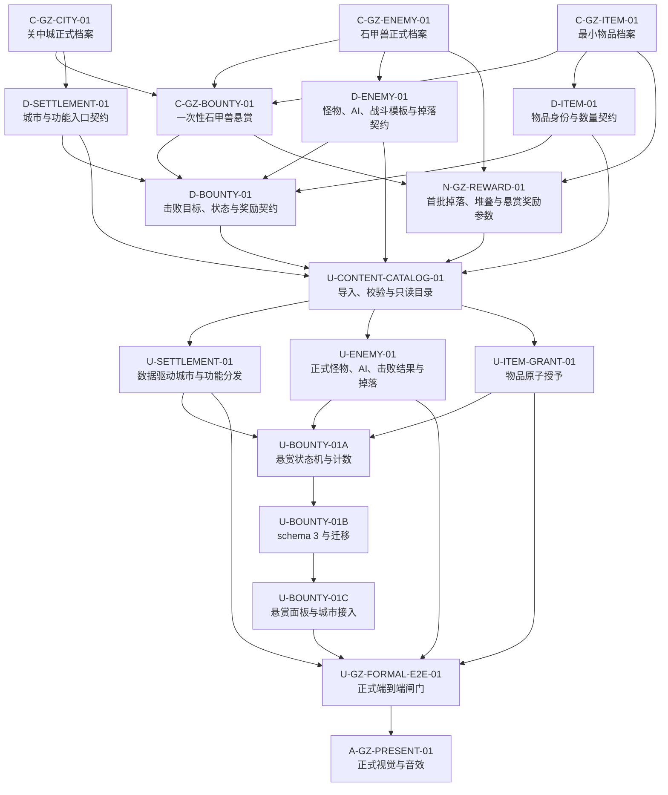

# 关中城市、怪物与悬赏最小正式框架设计

> 日期：2026-07-28
> 状态：负责人已确认方案 A、`DefeatEnemy` 首个目标类型、一次性悬赏、未开放城市功能显示但禁用、分领域正式数据方案与任务依赖图
> 目标：允许首批内容保持很小，但城市、怪物、物品与悬赏必须通过可复用、可校验、可存档的正式链路进入 Unity；不得以硬编码、占位日志或 fallback 冒充完成。

## 一、负责人决定与范围

负责人确认以下边界：

1. 采用“最小正式生产框架”，不建设统一万能内容系统。
2. 首轮只正式支持悬赏目标类型 `DefeatEnemy`；同类型悬赏可通过数据增加，新目标类型必须另加对应规则代码。
3. 石甲兽悬赏为一次性任务，状态固定为 `Available -> Accepted -> ObjectiveCompleted -> Claimed`。
4. 关中城中未实现的坊市、客栈和情报等功能仍可显示，但必须禁用并说明原因；不能进入占位流程。
5. 城市、怪物、物品和悬赏分别使用清晰的数据对象，通过同一只读内容目录按稳定 ID 查找。
6. 首轮完全在本地单机运行，不增加服务器、数据库、联网接口或远程状态。文中的“城市功能分发器”只表示 Unity 客户端内部把按钮操作交给对应功能处理器。
7. 首批生产样例只覆盖 `guanzhong_city`、`guanzhong_wild`、`enemy_shijiahou`、一次石甲兽悬赏及其直接需要的物品；其他内容不因框架建设自动升格为正式内容。
8. 首轮不做随机悬赏池、每日刷新、通用条件表达式、编辑器制作工具、其他任务目标、完整商店、装备系统或表现资源精修。

## 二、当前事实与根因

### 2.1 城市

`SettlementSceneController` 当前在 `PrototypeSettlements` 中硬编码三份 `SettlementDefinition`。`guanzhong_city` 的“坊市、悬赏、客栈、情报”只是字符串数组；所有服务按钮最终只输出 placeholder 日志。现有场景流转和 `settlementId` 上下文可复用，但城市内容和功能消费仍是原型结构。

### 2.2 怪物

`Enemies.csv` 已有 `enemy_shijiahou`，对应 `Char_Enemy_enemy_shijiahou.asset` 已通过固定 GUID 绑定到正式 `AdventureScene`。正式关中遭遇缺少该引用时会失败关闭，因此石甲兽不是纯临时测试对象。

现有导入器只把姓名、战斗属性和已装备术法写入通用 `CharacterData`，没有消费 CSV 中的 `type`、`aiType`、`realm`、`dropTable` 和 `description`。运行时仍使用通用 `SimpleAI`，掉落只按 `realmMultiplier` 返回硬编码文字，且旧 `CreateFallbackEnemy` 中还保留另一份硬编码石甲兽。因此它只是正式遭遇正在使用的最小战斗模板，不是完整怪物定义。

### 2.3 悬赏与存档

项目已有 `QuestStateStore`、`InventoryStateStore` 和版本化 `GameSessionSnapshot`，当前存档 schema 为 2。`QuestStateStore` 只保存通用七步布尔快照，没有任务定义、目标推进、领奖规则或生产调用者；不能把它直接解释成已经存在的悬赏系统。

## 三、采用方案及未采用方案

### 3.1 采用：分领域正式数据与统一只读目录

城市、怪物、物品、悬赏分别拥有数据契约和生成资产。生成的 `ContentCatalogData` 提供统一的只读 ID 查找入口，但不把四个领域压成通用键值节点。

优点：

- 每类数据的字段、校验和运行时职责可独立理解、测试和扩展。
- 新增同结构城市、击杀悬赏、物品或使用现有 AI 的普通怪物时只增加数据。
- 现有 `CharacterData`、`GameSession`、场景返回上下文和正式 Adventure 所有者可以复用。
- 不为首个样例引入条件 DSL、通用事件总线或动态后端。

### 3.2 不采用：统一万能内容目录

不把城市、任务、怪物、奖励抽象成同一种通用节点，也不在首轮建立任意条件表达式。该方案虽然灵活，但会弱化领域校验并显著增加调试成本。

### 3.3 不采用：继续扩展场景控制器

不继续向 `SettlementSceneController`、`AdventureSceneController` 或按钮回调中追加内容数组和任务规则。该方案改动较少，但每增加内容都可能要求修改场景代码，不符合正式框架目标。

## 四、事实源与生成链

固定单向关系：

```text
docs 中的设计与内容事实
  -> DataConfig CSV 的结构化生产配置
  -> DataConfigImporter 整表及跨表校验
  -> 保持 GUID 的 Unity ScriptableObject 资产
  -> ContentCatalogData 只读索引
  -> Settlement / Adventure / Combat / Bounty 消费者
  -> GameSession 只保存实例进度
```

规则：

1. `docs/` 继续决定城市、怪物、任务和物品的设计事实；CSV 是这些批准事实的机器可读生产投影。
2. Unity asset 只能由导入器生成或更新，不能成为可独立编辑的第二事实源。
3. ID 使用小写 ASCII 稳定键。显示名、对象名、数组位置、asset 路径和本地化文本都不能替代 ID。
4. 正式场景通过序列化引用绑定同一 `ContentCatalogData` asset；`SceneBuilder` 重建场景时必须保持同一目录 GUID。
5. 导入器先验证全部相关表，再更新任一资产。失败时保持目标资产集合不变，不留下半导入状态。
6. 已存在的同 ID 资产必须原位更新并保留 GUID；同 ID 多资产、路径与 ID 冲突或手工修改 ID 均失败关闭。

## 五、正式数据模型

### 5.1 `SettlementData`

最低字段：

- `settlementId`
- `displayNameKey`
- `contentScope`
- `settlementType`
- `regionId`
- `ownerFactionId`
- `visualThemeId`
- `features[]`
- `adventureEntranceIds[]`

每个城市功能条目包含：

- `featureId`
- `displayNameKey`
- `availability`：`enabled` 或 `disabled`
- `disabledReasonKey`：禁用时必填，启用时为空

启用的 `featureId` 必须能由城市功能分发器解析到一个已注册处理器；禁用功能不得调用处理器。首批 `bounty_board` 为启用状态，其余未实现功能为带原因的禁用状态。

### 5.2 `EnemyData`

最低字段：

- `enemyId`
- `displayNameKey`
- `descriptionKey`
- `contentScope`
- `enemyTypeId`
- `aiProfileId`
- `realmId`
- `combatTemplate`
- `dropEntries[]`

`combatTemplate` 引用现有 `CharacterData`，只承载通用战斗属性。`EnemyData` 承载怪物身份和怪物专属语义；二者由同一 `Enemies.csv` 行生成，不能手工双写。

每个掉落条目包含正式 `itemId`、`dropChancePercent` 及正整数数量。概率范围为 `0..100`；结算对每项取得 `[0, 100)` 的随机值，严格小于 `dropChancePercent` 时成功。随机源必须可注入，测试不得依赖全局随机状态。运行时不得再由 `realmMultiplier` 推导默认掉落。

### 5.3 `ItemData`

首轮只建立掉落与悬赏奖励所需的最小身份目录：

- `itemId`
- `displayNameKey`
- `descriptionKey`
- `contentScope`
- `itemCategory`
- `maxStack`

本轮不定义装备槽、售价、商店库存、使用效果或完整道具编辑器。物品不存在、数量非法或超过明确堆叠规则时，奖励和掉落提交失败关闭。

### 5.4 `BountyData`

最低字段：

- `bountyId`
- `titleKey`
- `descriptionKey`
- `contentScope`
- `issuerSettlementId`
- `objectiveType`，首轮只允许 `defeat_enemy`
- `targetEnemyId`
- `requiredCount`
- `allowedAdventureId`
- `rewardEntries[]`
- `repeatPolicy`，首批固定 `one_time`

每个奖励条目只引用正式 `itemId` 和正整数数量。具体物品与数量必须由 `C-GZ-BOUNTY-01` 锁定；没有批准结果时，数据和 Unity 任务保持阻塞，不能填测试默认值。

四类数据的 `contentScope` 沿用项目既有内容可用性语义。正式场景、启用的城市功能、正式悬赏及其全部引用只能消费生产范围内容；草稿或原型行可以继续作为迁移输入存在，但不能被正式目录查询结果或场景绑定悄悄升格。

## 六、Unity 组件与职责

### 6.1 `ContentCatalogData`

生成资产只提供四类只读查找：

- `TryGetSettlement(settlementId)`
- `TryGetEnemy(enemyId)`
- `TryGetItem(itemId)`
- `TryGetBounty(bountyId)` 及按发布城市查询悬赏

它不保存玩家状态、不加载场景、不执行战斗或奖励，也不是服务器。

### 6.2 城市场景

`SettlementSceneController` 只负责：

- 读取 `GameSession.CurrentSettlementId`
- 从目录取得 `SettlementData`
- 将城市字段交给视图
- 将功能点击交给 `SettlementFeatureDispatcher`
- 维持现有 World / Adventure 进入与返回上下文

`SettlementFeatureDispatcher` 是本地 Unity 组件。它按 `featureId` 查找功能处理器；首轮只注册 `bounty_board`。未知或禁用功能返回稳定失败原因，不输出 placeholder 完成日志。

正式 UI 使用独立视图组件和序列化引用。首轮允许低成本视觉样式，但不再把新界面继续堆进一个运行时动态生成的大控制器。

### 6.3 怪物与战斗

正式 Adventure 的遭遇引用 `EnemyData`，不再只引用 `CharacterData`。生成流程为：

```text
EnemyData
  -> combatTemplate
  -> Character.FromData
  -> EnemyUnit 同时保留 enemyId 与 EnemyData
```

`aiProfileId=ai_melee` 必须映射到首个正式近战 AI 行为。首轮复用并显式命名现有确定性顺序：尝试合法的已装备能力；否则向目标移动；相邻时进行基础攻击；均不可行时防御。石甲兽没有已装备能力，因此实际表现为接近、近战、无法行动时防御。未实现的 AI 类型不能在正式遭遇中使用。

战斗胜利生成结构化结算，不再生成物品名称字符串：

- `enemyId`
- `adventureId`
- `dropGrants[]`
- `outcome`

`AdventureSceneController` 继续是正式遭遇结算和返回的唯一所有者。旧 `CreateFallbackEnemy` 可暂时留在不可达旧原型中，但正式场景和正式目录不得调用它。

### 6.4 悬赏运行时

悬赏规则由独立的 `BountyRuntime` 纯逻辑边界负责：

- `Accept`
- `RecordDefeat`
- `Claim`
- `GetState`

界面只读取结果并提交请求，不判断任务是否合法。

`RecordDefeat` 只接受 Adventure 所有者在胜利结算时提交的结构化 `adventureId + enemyId`。同时满足下列条件才增加进度：

- 悬赏状态为 `Accepted`
- `objectiveType=defeat_enemy`
- 敌人 ID 等于 `targetEnemyId`
- 冒险 ID 等于 `allowedAdventureId`

Adventure 只允许从 `Combat` 向已结算／返回状态消费一次胜负结果，确保同一场战斗至多提交一次悬赏进度。败北、主动退出、错误地点和错误敌人均不计数。

### 6.5 背包原子提交

怪物掉落和悬赏奖励复用同一个结构化物品授予入口。入口先对全部物品 ID、数量和堆叠结果建立新快照；全部合法后一次性替换背包状态。

悬赏领奖同时构造新的背包状态与 `Claimed` 悬赏状态，由 `GameSession` 在同一次提交中替换。任意校验失败时两者均保持不变，禁止出现半领取状态。

## 七、悬赏状态与存档

新增独立 `BountyStateStore`，不把现有 `QuestStateStore` 的七步布尔状态重新解释为悬赏。

每个 `BountyState` 至少保存：

- `bountyId`
- `status`
- `progress`

合法状态：

```text
无实例 = Available
Available -> Accepted
Accepted -> ObjectiveCompleted
ObjectiveCompleted -> Claimed
```

`Claimed` 为一次性终态。非法逆向转换、进度小于 0、进度超过目标、未完成领奖、重复接取和重复领奖均返回稳定失败，不修改状态。

存档 schema 从当前版本 2 升级到版本 3，并增加 `bounties[]`：

- 版本 0：按既有迁移规则恢复世界／场景上下文，原有集合为空，悬赏集合为空。
- 版本 1：保留原任务、背包和 NPC 集合，悬赏集合为空。
- 版本 2：继续保留筑基／紫府状态与原有集合，悬赏集合为空。
- 版本 3：完整保存并恢复悬赏状态。

恢复先验证 schema、ID、状态、进度、重复项和内容引用，再原子替换会话。正式内容 ID 改名或删除时必须提供显式迁移；不能静默删除玩家进度。

## 八、首批正式内容

首批只升格下列生产样例：

- 城市：`guanzhong_city`
- 城市功能：`bounty_board`
- 冒险：`guanzhong_wild`
- 怪物：`enemy_shijiahou`
- AI：`ai_melee`
- 悬赏：`bounty_guanzhong_shijiahou`
- 直接物品：`item_shijia_piece` 与悬赏奖励实际引用的低阶物品

石甲兽可继续使用基础战棋标记；首轮不要求专属模型、动画、音效或特效。标记的身份和显示文本必须来自正式 `EnemyData`。

其他城市、Enemy CSV 行或服务字符串不会因为目录存在而自动获得“生产可用”声明。它们只有在引用完整、处理器可用并通过直接验证后才能进入正式场景。

## 九、失败关闭与校验

### 9.1 导入阶段

必须拒绝：

- 缺文件、错误表头、短行、额外未知列
- 空、非法或重复稳定 ID
- 未知本地化、城市、冒险、怪物、AI、物品或奖励引用
- 非正目标数量、非正物品数量、非法概率或堆叠上限
- 同一城市重复功能或冒险入口
- 启用功能没有运行时处理器
- 生产内容引用草稿／原型范围内容
- 一次性悬赏缺发布城市、目标、地点或奖励
- `EnemyData` 与 `CharacterData` 投影不一致
- 既有资产 ID、路径或 GUID 冲突

### 9.2 运行阶段

- 城市数据缺失时不进入默认城市；显示错误并保留返回世界入口。
- 单项悬赏错误只禁用该悬赏，不伪造目标或奖励。
- 正式敌人、AI 或掉落配置缺失时阻止遭遇启动，不使用 fallback。
- 领奖或掉落提交失败时保持背包与悬赏状态不变。
- 未知存档版本、未知生产 ID、重复状态或非法进度拒绝恢复。

## 十、验证矩阵

| 层级 | 最小充分验证 |
|---|---|
| 内容 | 城市、怪物、物品、悬赏分别符合对应规范；稳定 ID、地点、目标、奖励和禁止项明确。 |
| CSV / asset | 整表和跨表正反 fixture；字段逐项投影；现有资产原位更新且 GUID 不变；`tools/check-data-chain.ps1` 覆盖四类新链路。 |
| 城市 | 正确城市按 ID 加载；悬赏功能可进入；未开放功能显示禁用原因；未知城市保留返回出口。 |
| 怪物 | 正式场景只绑定 `EnemyData`；石甲兽使用 `enemy_shijiahou`、`ai_melee` 和正式掉落；缺任一引用失败关闭。 |
| 悬赏规则 | 四状态合法转换；所有非法转换；正确／错误敌人和地点；胜利／败北；单场至多计数一次；永久防重复领奖。 |
| 背包 | 普通掉落与悬赏奖励分别进入背包；多物品原子成功或原子失败。 |
| 存档 | 版本 0、1、2 到版本 3 的迁移；版本 3 往返；非法 ID、状态、进度和重复项拒绝。 |
| 正式闭环 | 关中城接取 -> `guanzhong_wild` -> 击败石甲兽 -> 普通掉落 -> 返回关中城 -> 领取悬赏 -> 保存 -> 读取后仍为 `Claimed`。 |

实现阶段按实际影响运行：

- `dotnet build src/TianZhang.EditModeTests.csproj`
- 相关 Unity EditMode 测试
- 正式场景架构批处理校验
- `pwsh -NoProfile -ExecutionPolicy Bypass -File tools/check-data-chain.ps1`
- `pwsh -NoProfile -ExecutionPolicy Bypass -File tools/check-review-text.ps1 -Paths 开发管理,docs,src/Assets/Scripts,src/Assets/Tests`
- `git diff --check`

本设计不改变角色战斗数值，不要求运行 BattleSim。内容任务若要确定掉落概率、奖励数量或经济强度，必须先按项目数值规则建立对应验证，不由 Unity 实现任务自行猜测。

## 十一、任务依赖结构



文字顺序：

1. `C-GZ-CITY-01`、`C-GZ-ENEMY-01`、`C-GZ-ITEM-01` 可并行；三者完成后收口 `C-GZ-BOUNTY-01`。
2. 内容事实分别进入 `D-SETTLEMENT-01`、`D-ENEMY-01`、`D-ITEM-01`；`D-BOUNTY-01` 在悬赏内容和三项引用契约完成后收口。
3. `N-GZ-REWARD-01` 在内容身份和悬赏类别完成后，只锁定首批掉落概率／数量、堆叠上限与一次性悬赏奖励；不建立全局经济。
4. `U-CONTENT-CATALOG-01` 在四项数据契约与首批参数均完成后，统一实现导入、GUID 保持、跨表校验和只读查找。
5. `U-SETTLEMENT-01`、`U-ENEMY-01`、`U-ITEM-GRANT-01` 在目录基础上可并行。
6. `U-BOUNTY-01A -> U-BOUNTY-01B -> U-BOUNTY-01C` 依次完成规则、存档和界面接入。
7. `U-GZ-FORMAL-E2E-01` 关闭 P1 功能闸门；`A-GZ-PRESENT-01` 只在该闸门后进入 P2。
8. 其他城市、悬赏和怪物内容保持 P3 冻结，待正式框架通过后按数据包另行授权。

## 十二、任务责任、队列与优先级

- 上述框架和首批样例均为 P1；`A-GZ-PRESENT-01` 为 P2；批量内容扩展为 P3 冻结。
- 内容卡由内容责任方按对应规范起草并标记待审，Codex 负责复审。
- 数据契约、Unity 运行时、存档、检查器与端到端闸门由 Codex 负责。
- 父线不直接执行。只有依赖真实完成、任务卡字段齐全且路径不冲突的叶子任务进入 `dispatchState=ready` 队列。
- 建卡时首先为三项可并行内容叶子和其直接复审建立完整卡；其余任务保留阻塞投影，随依赖完成事件逐级建立或转为 ready。
- 同一调度器需要线性排序时，本父线内部固定顺序为：`C-GZ-CITY-01`、`C-GZ-ENEMY-01`、`C-GZ-ITEM-01`、`C-GZ-BOUNTY-01`、`D-SETTLEMENT-01`、`D-ITEM-01`、`D-ENEMY-01`、`D-BOUNTY-01`、`N-GZ-REWARD-01`、`U-CONTENT-CATALOG-01`、`U-SETTLEMENT-01`、`U-ITEM-GRANT-01`、`U-ENEMY-01`、`U-BOUNTY-01A`、`U-BOUNTY-01B`、`U-BOUNTY-01C`、`U-GZ-FORMAL-E2E-01`、`A-GZ-PRESENT-01`。依赖未满足的项跳过但不重排。
- 既有已批准的战斗、UI、存档和效果任务不被本父线吞并。没有直接依赖时可并行；不得为加快本线而删除它们的完成条件。
- 任务优先级调整不能把尚未完成的 `U-COMBAT-01B` 当成石甲兽悬赏的假前置。当前单敌 CTB 已能支撑 `DefeatEnemy`；统一攻击档案另按其真实依赖推进。

## 十三、停止条件

任一任务出现下列情况时停止本分支，不继续叠加补丁：

1. 内容尚未锁定物品、掉落或奖励，却要求 Unity 填入默认值。
2. 需要通过显示名称、GameObject 名称或 asset 路径识别城市、怪物、任务或物品。
3. 需要继续扩大 `SettlementSceneController`、`AdventureSceneController` 或按钮回调以保存领域状态。
4. 需要新建第二套任务、背包、场景流转或存档所有者。
5. 需要让正式场景依赖 `CreateFallbackEnemy`、硬编码城市数组、placeholder 服务日志或文字掉落。
6. 需要顺手实现其他目标类型、随机任务池、每日刷新、商店、装备、完整 NPC 发布者或表现资源精修。
7. 新增或修改概率、数量或经济强度却没有对应事实源和验证授权。

命中停止条件时，保留失败证据并把下游保持为非 ready；不得通过兼容分支、静默默认值或测试 fixture 维持表面闭环。

## 十四、完成标准

P1 只有同时满足下列条件才完成：

1. `guanzhong_city`、`enemy_shijiahou`、最小物品和 `bounty_guanzhong_shijiahou` 均有 docs、CSV、asset 和运行时可追踪链路。
2. 正式城市和 Adventure 不再依赖硬编码内容或 fallback 才能完成该闭环。
3. 悬赏状态、击败进度、普通掉落、悬赏奖励和存档恢复均由稳定 ID 驱动。
4. 失败配置具有稳定、可观察的失败关闭结果。
5. 新增同结构城市、新 `DefeatEnemy` 悬赏、新物品和使用现有 AI 的普通怪物时不修改核心代码。
6. 端到端回归证明接取、战斗、返回、领奖和保存读取完整成立。
7. P2 表现资源没有反向成为 P1 功能正确性的前置。
